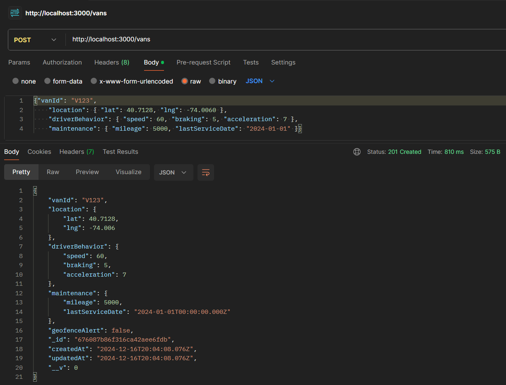
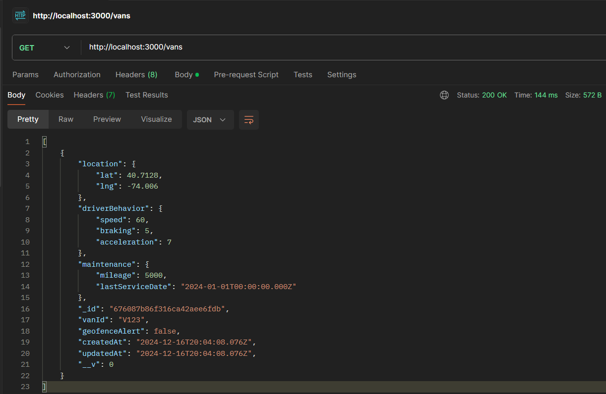
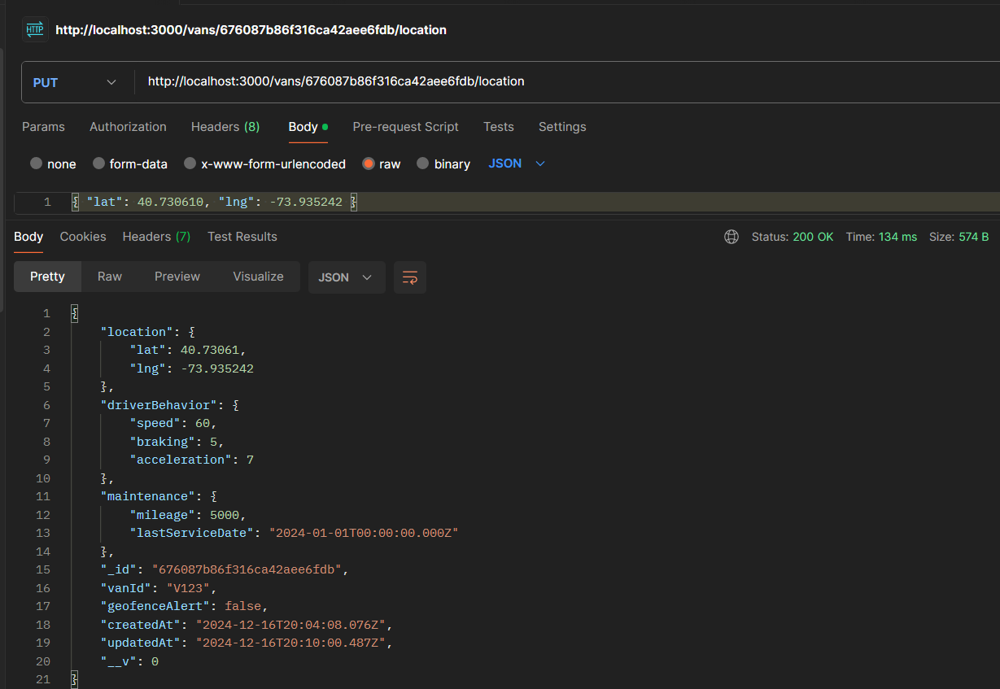
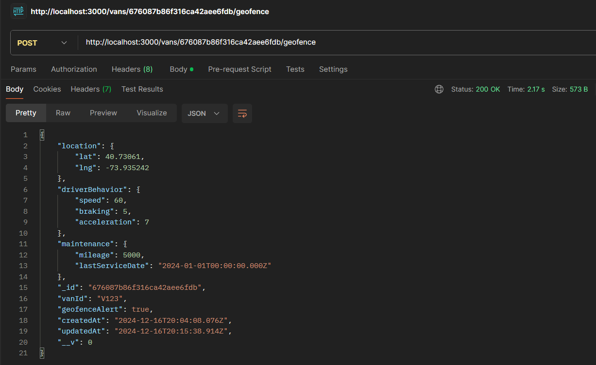

# Vans Tracking System

Week 1&2 Assignment<br>
This project is a backend system built with Node.js, Express, and MongoDB for tracking and managing vans locations, driver behavior, maintenance, and geofence alerts.


## **Table of Contents**
1. [Features](#features)
2. [Technologies Used](#technologies-used)
3. [Getting Started](#getting-started)
4. [API Endpoints](#api-endpoints)
7. [Future Enhancements](#future-enhancements)


## **Features**

- Add new vans to the system.
- Retrieve a list of all vans.
- Update van location in real-time.
- Trigger geofence alerts for vans.
- Check maintenance alerts for vans based on mileage.


## **Technologies Used**

- **Node.js** with **Express**
- **MongoDB Atlas** (cloud database)
- **Mongoose**
- **Postman** for API testing
- **CORS** for cross-origin requests

<br>

## **Getting Started**

### Prerequisites
- Node.js installed
- MongoDB Atlas account and connection URL

### Installation
1. Clone the repository:
   ```bash
   git clone https://github.com/your-username/vansTask
   cd vansTask
   ```
2. Navigate to the `backend` folder and install dependencies:
   ```bash
   cd backend
   npm install
   ```
3. Start the backend server:
   ```bash
   npm run dev
   ```

4. Configure the MongoDB connection by adding your MongoDB URI in `config.js`:

    ```bash
    export const mongoDBURL = 'mongodb+srv://your-mongodb-connection-url'
    ```

<br>


## **API Endpoints**

### 1. **Add a New Van**
**Endpoint**: `POST http://localhost:3000/vans`  

**Request Body**:
```json
{
    "vanId": "V123",
    "location": { "lat": 40.7128, "lng": -74.0060 },
    "driverBehavior": { "speed": 60, "braking": 5, "acceleration": 7 },
    "maintenance": { "mileage": 5000, "lastServiceDate": "2024-01-01" }
}
```



---

### 2. **List All Vans**
**Endpoint**: `GET http://localhost:3000/vans`

**Response**:



---

### 3. **Update Van Location**
**Endpoint**: `PUT /vans/:id/location`  
**Example**: `http://localhost:3000/vans/676087b86f316ca42aee6fdb/location`

**Request Body**:
```json
{ "lat": 40.730610, "lng": -73.935242 }
```

**Response**:
```json
{
    "vanId": "V123",
    "location": { "lat": 40.730610, "lng": -73.935242 },
     ...
}
```




---

### 4. **Trigger Geofence Alert**
**Endpoint**: `POST /vans/:id/geofence`  
**Example**: `http://localhost:3000/vans/676087b86f316ca42aee6fdb/geofence`

**Response**:
```json
{
    "vanId": "V123",
    "geofenceAlert": true
}
```




---

### 5. **Get Maintenance Alerts**
**Endpoint**: `GET /vans/maintenance`

**Response**:
```json
[
    {
        "vanId": "V123",
        "maintenance": { "mileage": 15000, "lastServiceDate": "2024-01-01" }
    }
]
```


---

## **Future Enhancements**
- Add a real-time dashboard to visualize van locations and statuses.
- Implement authentication and authorization for user roles (Admin, Driver).
- Integrate third-party geofencing and route optimization APIs.
- Add functionality for creating and managing driver profiles.
- Allow drivers to report incidents or issues directly from the system.

